# System Architecture

## Overview
Mastery Pulse is a full-stack learning-and-adoption platform with two integrated loops: **Mastery Mesh** (certification-targeted learning, quiz generation, and grading) and **Adoption Pulse** (usage-signal ingestion, correlation, and nudge delivery). Eleven LLM-backed agents are orchestrated by plain async Python workflows; no LangGraph or Temporal.

## Architecture Diagram

```mermaid
graph TB
    subgraph "Frontend (React + Vite)"
        UI_AUTH[Auth / Login<br/>React Router]
        UI_LEARN[Learning Portal<br/>3D Portal / Three.js]
        UI_ADMIN[Admin Dashboard<br/>TanStack Query]
        UI_PULSE[Adoption Pulse<br/>AdoptionTrendChart]
    end

    subgraph "Application Boundary"
        subgraph "API Layer (FastAPI)"
            AUTH_RT[auth router<br/>/api/v1/auth]
            PRAC_RT[practitioners router<br/>/api/v1/practitioners]
            CERT_RT[certifications router<br/>/api/v1/certifications]
            PROF_RT[profiles router<br/>/api/v1/profiles]
            PULSE_RT[pulse router<br/>/api/v1/pulse]
            NUDGE_RT[nudges router<br/>/api/v1/nudges]
            QUIZ_RT[mock-exams router<br/>/api/v1/mock-exams]
            OBS_RT[observability router<br/>/api/v1/observability]
            PADMIN_RT[product-admin router<br/>/api/v1/product-admin]
        end

        subgraph "Agent Layer (async Python)"
            CERT_ADV[CertificationAdvisor<br/>recommends cert]
            CURR_PLAN[CurriculumPlanner<br/>builds learning path]
            ITEM_WRITE[ItemWriter<br/>writes MCQ/free_text/scenario]
            QUIZ_GEN[QuizBatchGenerator<br/>batch MCQ generation]
            GRADER[Grader<br/>scores attempts]
            DOMAIN_SCOR[DomainScorer<br/>rates cert domains]
            SKILL_PROF[SkillProfiler<br/>computes snapshots]
            USAGE_SIG[UsageSignal<br/>normalises signals]
            CORR[CorrelationAgent<br/>mastery vs adoption gap]
            NUDGE_COMP[NudgeComposer<br/>drafts nudges]
            CERT_DISC[CertDomainDiscovery<br/>refreshes exam domains]
            CERT_SKILL[CertSkillMapper<br/>maps skills to domains]
            MOCK_GEN[MockExamGenerator<br/>generates exam questions]
            BSL[ByteSizedLesson<br/>micro lessons]
        end

        subgraph "Model Client Layer"
            MULTI_TIER[MultiTierModelClient<br/>3-tier chain]
            NVIDIA_CB[NvidiaCircuitBreaker<br/>in-memory]
            ULTRA[NVIDIAModelClient<br/>Nemotron Ultra 253B]
            LIGHTNING[NVIDIAModelClient<br/>Nemotron Lightning 70B]
            HAIKU[AnthropicModelClient<br/>Haiku 4.5]
        end

        subgraph "MCP Servers (stdio)"
            MCP_LP[learning_portal server<br/>LTI / content]
            MCP_US[usage_signals server<br/>Claude Code / git signals]
        end
    end

    subgraph "Data Stores"
        PG[(PostgreSQL<br/>Primary DB)]
        PGVEC[(pgvector extension<br/>optional semantic search)]
    end

    subgraph "External"
        ANTHROPIC_API[Anthropic API<br/>Claude Haiku 4.5]
        NVIDIA_API[NVIDIA NIM API<br/>Nemotron Ultra / Lightning]
    end

    UI_AUTH & UI_LEARN & UI_ADMIN & UI_PULSE --> AUTH_RT
    UI_LEARN --> PRAC_RT & CERT_RT & PROF_RT & QUIZ_RT & NUDGE_RT
    UI_ADMIN --> OBS_RT & PADMIN_RT & NUDGE_RT
    UI_PULSE --> PULSE_RT

    AUTH_RT & PRAC_RT & CERT_RT & PROF_RT & PULSE_RT --> PG
    NUDGE_RT & QUIZ_RT & OBS_RT & PADMIN_RT --> PG

    CURR_PLAN & ITEM_WRITE & CERT_ADV & GRADER & DOMAIN_SCOR --> MULTI_TIER
    SKILL_PROF & USAGE_SIG & CORR & NUDGE_COMP & CERT_DISC --> MULTI_TIER
    CERT_SKILL & MOCK_GEN & BSL & QUIZ_GEN --> MULTI_TIER

    MULTI_TIER --> NVIDIA_CB
    NVIDIA_CB --> ULTRA & LIGHTNING
    MULTI_TIER --> HAIKU
    ULTRA & LIGHTNING --> NVIDIA_API
    HAIKU --> ANTHROPIC_API

    MCP_LP & MCP_US --> USAGE_SIG
    CURR_PLAN & ITEM_WRITE & GRADER --> PG
    SKILL_PROF & USAGE_SIG & CORR & NUDGE_COMP --> PG
```

## Layer Summary

| Layer | Purpose | Key Components |
|-------|---------|----------------|
| Frontend | UI for practitioners, admins, and product admins | React 18 + Vite, Three.js (3D portal), TanStack Query v5, React Router v6 |
| API (FastAPI) | REST API at `/api/v1/*`, session-cookie auth, CORS | 16 route modules, `deps/session.py` (session guard), `deps/plan.py` |
| Agent Layer | 11+ LLM agents with typed input/output via Structured Outputs | `base.py` (Agent ABC), per-agent `.py` files, `prompts/*.md` system prompts |
| Model Client | Dual-provider, multi-tier LLM abstraction with circuit breaker | `AnthropicModelClient`, `NVIDIAModelClient`, `MultiTierModelClient`, `NvidiaCircuitBreaker` |
| MCP Servers | Local stdio MCP adapters for internal data | `learning_portal/server.py`, `usage_signals/server.py` |
| Data Layer | PostgreSQL with SQLAlchemy async ORM + Alembic migrations | `db/models.py` (all ORM models), `db/session.py`, `db/migrations/` |

## External Integrations

- **Anthropic API** — Claude Haiku 4.5 for structured outputs; primary in ANTHROPIC mode, Tier 3 fallback in NVIDIA mode
- **NVIDIA NIM API** — Nemotron Ultra 253B + Lightning 70B via OpenAI-compatible endpoint; primary tiers in NVIDIA mode
- **bcrypt** — password hashing for admin/product-admin auth (no passlib dependency)
- **pgvector** (optional) — Postgres extension for semantic search / vector similarity; not yet wired to a specific agent
