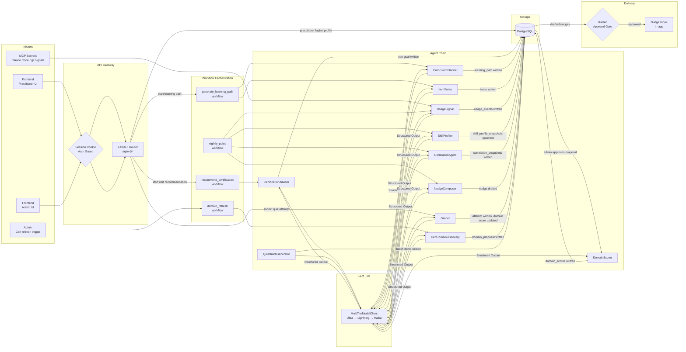

# Data Flow

## Overview
Data enters the system through three channels: (1) practitioner interactions via the frontend REST API, (2) admin-triggered LLM workflows, and (3) nightly MCP signal ingestion from Claude Code sessions and git commits. Data flows through the agent layer (LLM calls) and persists to PostgreSQL. The nudge pipeline is intentionally gated — no nudge is sent without human approval.

## Data Flow Diagram

## Data Pipelines

| Pipeline | Source | Processing | Destination |
|----------|--------|-----------|-------------|
| Cert Recommendation | Practitioner questionnaire | CertificationAdvisor (LLM) | `practitioner_certification_goals` |
| Learning Path | Cert goal + skill snapshot | CurriculumPlanner (LLM) | `learning_paths`, `learning_path_items` |
| Quiz Items | Skill + cert domain | ItemWriter / QuizBatchGenerator (LLM) | `items` |
| Attempt Grading | Practitioner response | Grader (LLM) | `attempts`, `skill_profile_events`, `certification_domain_scores` |
| Nightly Pulse | MCP signals (Claude Code / git) | UsageSignal → SkillProfiler → CorrelationAgent → NudgeComposer | `usage_events`, `skill_profile_snapshots`, `correlation_snapshots`, `nudges` |
| Domain Refresh | Admin trigger → CertDomainDiscovery | Proposal review → DomainScorer | `certification_domain_proposals`, `certification_domain_versions`, `certification_domain_scores` |
| Mock Exams | Practitioner starts session | MockExamGenerator (LLM) | `mock_exam_sessions`, `mock_exam_questions` |
| Byte-sized Lessons | Practitioner requests | ByteSizedLessonAgent (LLM) | `byte_sized_lessons` |

## Integration Points

- **Inbound:** Frontend REST calls (cookie-authenticated), MCP stdio servers (local process)
- **Outbound:** Anthropic API (structured output), NVIDIA NIM API (OpenAI-compatible endpoint)
- **Internal async:** `asyncio.wait_for` timeouts between tier hops in MultiTierModelClient
- **Human gate:** Nudge approval (drafted → approved → sent) — no auto-send
- **Admin gate:** Domain proposal review (pending_review → approved/rejected)
