# Module Dependencies

## Overview
The codebase is cleanly separated into three top-level domains: `backend/app/` (FastAPI), `frontend/src/` (React + TypeScript), and `backend/tests/`. Within the backend, `app.db.models` and `app.agents.model_client` are the most-depended-upon modules (84 and 34 dependents respectively). Agents are strictly isolated — no agent imports another agent (enforced by convention from `base.py`). The model client layer bridges all agents to the LLM providers without business logic.

## Dependency Graph

```mermaid
graph TD
    subgraph "API Layer"
        ROUTES[app.api.routes.*<br/>16 router modules]
        DEPS[app.api.deps<br/>session + plan guards]
    end

    subgraph "Workflow Layer"
        WF[app.workflows.*<br/>recommend_cert, learning_path, nightly_pulse]
    end

    subgraph "Agent Layer"
        BASE[app.agents.base<br/>Agent ABC]
        CERT_ADV[app.agents.certification_advisor]
        CURR_PLAN[app.agents.curriculum_planner]
        ITEM_WRITE[app.agents.item_writer]
        QUIZ_GEN[app.agents.quiz_batch_generator]
        GRADER[app.agents.grader]
        DOMAIN_SCOR[app.agents.domain_scorer]
        SKILL_PROF[app.agents.skill_profiler]
        USAGE_SIG[app.agents.usage_signal]
        CORR[app.agents.correlation]
        NUDGE_COMP[app.agents.nudge_composer]
        CERT_DISC[app.agents.cert_domain_discovery]
        CERT_SKILL[app.agents.cert_skill_mapper]
        MOCK_GEN[app.agents.mock_exam_generator]
        BSL[app.agents.byte_sized_lesson]
    end

    subgraph "Infrastructure"
        MODEL_CLIENT[app.agents.model_client<br/>MultiTierModelClient]
        DB_MODELS[app.db.models<br/>all ORM models]
        DB_SESSION[app.db.session<br/>async engine + get_db]
        CONFIG[app.config<br/>Settings / get_settings]
        MCP_LP[app.mcp_servers.learning_portal]
        MCP_US[app.mcp_servers.usage_signals]
    end

    subgraph "External SDKs"
        ANTHROPIC_SDK[anthropic SDK]
        OPENAI_SDK[openai SDK]
        SQLALCHEMY[sqlalchemy asyncio]
        PYDANTIC[pydantic v2]
    end

    ROUTES --> DEPS --> DB_SESSION
    ROUTES --> DB_MODELS
    ROUTES --> WF

    WF --> CERT_ADV & CURR_PLAN & ITEM_WRITE & GRADER
    WF --> SKILL_PROF & USAGE_SIG & CORR & NUDGE_COMP
    WF --> CERT_DISC & DOMAIN_SCOR & QUIZ_GEN & MOCK_GEN & BSL

    CERT_ADV & CURR_PLAN & ITEM_WRITE & QUIZ_GEN --> BASE
    GRADER & DOMAIN_SCOR & SKILL_PROF & USAGE_SIG --> BASE
    CORR & NUDGE_COMP & CERT_DISC & CERT_SKILL & MOCK_GEN & BSL --> BASE

    BASE --> MODEL_CLIENT
    BASE --> DB_MODELS

    MODEL_CLIENT --> CONFIG
    MODEL_CLIENT --> ANTHROPIC_SDK
    MODEL_CLIENT --> OPENAI_SDK

    DB_SESSION --> SQLALCHEMY
    DB_MODELS --> SQLALCHEMY
    DB_MODELS --> PYDANTIC

    MCP_US --> USAGE_SIG
    MCP_LP --> CURR_PLAN

    linkStyle 0,1,2 stroke:#1976D2
    linkStyle 3,4,5,6 stroke:#26A69A
```

## Coupling Analysis

| Module | Fan-In | Fan-Out | Assessment |
|--------|--------|---------|------------|
| `app.db.models` | 84 | 2 (sqlalchemy, uuid) | **Highest change impact** — every route and agent depends on it |
| `app.agents.model_client` | 34 | 3 (anthropic, openai, config) | High impact — changes affect all agents |
| `app.agents.base` | 14 | 3 (model_client, db.models, pydantic) | All agents inherit it; stable contract |
| `app.config` | ~20 | 1 (pydantic-settings) | Core settings; stable |
| `app.db.session` | ~18 | 1 (sqlalchemy) | Engine + `get_db` dep; stable |
| `app.api.deps.session` | ~16 | 2 (db.models, config) | Auth guard; medium impact on change |
| Individual agents | 1–2 (workflow) | 3–5 | Low blast radius per agent |
| Individual routes | 0–1 (main.py) | 3–6 | Low blast radius per route module |

## Circular Dependencies
None detected. The no-agent-imports-agent rule, enforced by convention in `base.py`, prevents cross-agent coupling. Workflows are the sole orchestrators.
